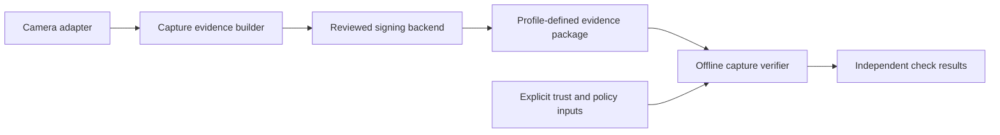

# Architecture

Status: proposed boundaries. No wire profile or public API is approved.

## Scope

This repository owns independent capture signing and verification. It is
separate from Apple ARI verification in open-ari-core and from operator receipts
that record a previous verification decision. Each makes a different claim.

## Crate boundaries

- `openari-capture` will orchestrate immutable capture inputs, processing records,
  canonical signed statements, and signing requests.
- `openari-capture-verify` will parse and verify independent profiles, using
  explicit policy, evaluation time, and trust/revocation snapshots.
- A shared evidence crate is deferred until reviewed code needs it. Keep only
  neutral data types and bounded codecs there; never signing keys or drivers.
- Camera adapters and hardware backends remain optional. Review each dependency
  and require capability discovery. Do not dynamically load arbitrary plugins.
- Bindings will call the native implementation. The existing `openari` CLI may
  expose optional capture commands after API review; command names are undecided.

Neither crate depends on the other today. Verification-only packages must be
testable without camera hardware, private keys, or network credentials.

## Evidence construction

Freeze each input before hashing or signing. Specify exact signed ranges,
canonical encoding, domain separation, and limits in the eventual profile.
Do not sign ambiguous serialization or trust unsigned algorithm/profile hints.
Bind metadata assertions to the same immutable capture transaction.

Track RAW evidence and each derived image separately. Record processing code,
version, configuration, and authenticated input/output bindings where available.
A signed processing description is still an assertion unless evidence establishes
that the described processing was enforced. Do not claim deterministic rendering
without specifying and testing the relevant pipeline.

Evaluate C2PA packaging and custom assertions against an independent sidecar
before selecting the wire format. Prefer established codecs and crypto libraries;
do not implement primitives or claim C2PA conformance from an application label.

## Verification

Report structural validity, signature validity, signer trust, key protection,
sensor-origin evidence, processing integrity, time evidence, freshness, and
revocation separately. An application policy may combine them, but must identify
its requirements and explain unresolved evidence. Unknown profiles, algorithms,
or trust roots cannot succeed through a weaker fallback.

Read no system clock or network implicitly. Bound file size, decoded pixels,
certificate paths, nesting, allocations, concurrency, and cancellation latency.
Never retrieve URLs from uploaded manifests automatically.
